# ใบงานปฏิบัติการ: การพัฒนาระบบจองห้องพักออนไลน์ด้วย CI/CD บน Railway และ GitHub

## วัตถุประสงค์
1. เพื่อเรียนรู้กระบวนการ CI/CD (Continuous Integration/Continuous Deployment)
2. เพื่อฝึกการนำแอปพลิเคชันเว็บขึ้นระบบคลาวด์ด้วย Railway
3. เพื่อฝึกการใช้ GitHub ในการจัดการซอร์สโค้ดและอัตโนมัติการทำงาน
4. เพื่อเข้าใจวงจรการพัฒนาซอฟต์แวร์แบบต่อเนื่อง
5. เพื่อนำความรู้จากใบงาน booking-web-application มาประยุกต์ใช้ในสภาพแวดล้อมจริง

## ทฤษฎีที่เกี่ยวข้อง

### 1. CI/CD (Continuous Integration/Continuous Deployment)
CI/CD เป็นวิธีปฏิบัติในการพัฒนาซอฟต์แวร์ที่ช่วยให้ทีมพัฒนาสามารถส่งมอบการเปลี่ยนแปลงโค้ดได้อย่างรวดเร็วและน่าเชื่อถือ:

1. **Continuous Integration (CI)**: 
   - การรวมโค้ดเข้าด้วยกันบ่อยๆ (อย่างน้อยวันละครั้ง)
   - มีการทดสอบอัตโนมัติทุกครั้งที่มีการรวมโค้ด
   - ช่วยตรวจจับข้อผิดพลาดได้เร็วขึ้น

2. **Continuous Deployment (CD)**:
   - การนำโค้ดที่ผ่านการทดสอบทั้งหมดขึ้นระบบโดยอัตโนมัติ
   - ลดขั้นตอนการทำงานด้วยมือ
   - ทำให้สามารถส่งมอบฟีเจอร์ใหม่ได้เร็วขึ้น

### 2. GitHub
GitHub เป็นแพลตฟอร์มสำหรับจัดการซอร์สโค้ดด้วยระบบ Git:

1. **GitHub Flow**:
   - การทำงานบน branch ย่อยแทนที่จะทำบน main branch โดยตรง
   - ใช้ Pull Request (PR) เพื่อรวมโค้ดเข้า main branch
   - การรีวิวโค้ดก่อนรวมเข้า main branch

2. **GitHub Actions**:
   - เครื่องมือในการสร้าง workflow อัตโนมัติบน GitHub
   - สามารถตั้งค่าให้ทำงานเมื่อมีเหตุการณ์เกิดขึ้น เช่น push, pull request
   - ใช้ในการทดสอบ, ตรวจสอบคุณภาพโค้ด และ deploy โค้ด

### 3. Vercel
Vercel เป็นแพลตฟอร์มคลาวด์ที่ออกแบบมาเพื่อรองรับการ deploy เว็บแอปพลิเคชันแบบ frontend:

1. **คุณสมบัติของ Vercel**:
   - Preview Deployments: สร้างลิงก์สำหรับดูตัวอย่างแอปพลิเคชันทุกครั้งที่มีการ push หรือ pull request
   - Zero Configuration: ตรวจจับและตั้งค่าโปรเจคอัตโนมัติ
   - Global CDN: กระจายเว็บแอปพลิเคชันไปยังเซิร์ฟเวอร์ทั่วโลก
   - ทำงานร่วมกับ GitHub ได้อย่างราบรื่น

2. **ประเภทของการ Deploy บน Vercel**:
   - Production Deployment: การ deploy ไปยังสภาพแวดล้อมจริง (เกิดจากการ push ไปยัง main branch)
   - Preview Deployment: การ deploy สำหรับตรวจสอบก่อนนำขึ้นจริง (เกิดจากการ push ไปยัง branch อื่นหรือสร้าง PR)

### 4. Backend Hosting Services
สำหรับ backend เราสามารถใช้บริการ hosting อื่นๆ ที่เหมาะกับ Node.js:

1. **Railway**:
   - แพลตฟอร์มที่ใช้งานง่าย รองรับ Node.js
   - มีระบบติดตามทรัพยากรและการใช้งาน
   - รองรับการเชื่อมต่อกับฐานข้อมูล

2. **Render**:
   - ให้บริการ Free tier สำหรับโปรเจคขนาดเล็ก
   - รองรับหลายภาษาและเฟรมเวิร์ค รวมถึง Node.js
   - มีระบบ CI/CD ในตัว

## อุปกรณ์และโปรแกรมที่ใช้
1. คอมพิวเตอร์ที่เชื่อมต่ออินเทอร์เน็ต
2. Git และบัญชี GitHub
3. บัญชี Vercel
4. บัญชี Railway หรือ Render (สำหรับ host backend)
5. Node.js และ npm
6. Visual Studio Code หรือโปรแกรม code editor อื่นๆ
7. โค้ดของ Booking Web Application จากใบงานก่อนหน้า

## การเตรียมสภาพแวดล้อม

### 1. สมัครและตั้งค่าบัญชี GitHub
1. เข้าไปที่ [GitHub](https://github.com/) และสมัครบัญชีหากยังไม่มี
2. ตั้งค่าข้อมูลส่วนตัวและอีเมล
3. สร้าง Personal Access Token สำหรับใช้กับ CLI:
   - ไปที่ Settings > Developer settings > Personal access tokens
   - เลือก Generate new token
   - ตั้งชื่อและเลือกสิทธิ์ (อย่างน้อยให้เลือก repo)
   - บันทึก token ไว้ใช้ในภายหลัง

### 2. ติดตั้ง Git และตั้งค่า
1. ดาวน์โหลดและติดตั้ง Git จาก [git-scm.com](https://git-scm.com/downloads)
2. เปิด Command Line หรือ Terminal และตั้งค่า Git:
```bash
git config --global user.name "ชื่อของคุณ"
git config --global user.email "อีเมลที่ใช้สมัคร GitHub"
```

### 3. สมัครบัญชี Vercel
1. เข้าไปที่ [Vercel](https://vercel.com/) และสมัครบัญชี (แนะนำให้สมัครด้วยบัญชี GitHub)
2. ทำการยืนยันอีเมล  
   
   /*เชื่อมต่อบัญชี GitHub กับ Vercel:
   - เลือก "Add GitHub Account" ในหน้า Dashboard
   - อนุญาตให้ Vercel เข้าถึงบัญชี GitHub */

### 4. สมัครบัญชี Railway หรือ Render
1. สำหรับ Railway: เข้าไปที่ [Railway.app](https://railway.app/) และสมัครบัญชี
2. หรือสำหรับ Render: เข้าไปที่ [Render.com](https://render.com/) และสมัครบัญชี
3. เชื่อมต่อกับบัญชี GitHub

## ขั้นตอนการทดลอง

### ส่วนที่ 1: การเตรียมโครงสร้างโปรเจค

#### 1.1 สร้าง Repository บน GitHub สำหรับโปรเจคทั้งหมด
1. ล็อกอินเข้า GitHub
2. กด "New" เพื่อสร้าง repository ใหม่
3. ตั้งชื่อ repository เป็น "booking-app-demo"
4. เลือก "Public" และกด "Create repository"
5. จดบันทึก URL ของ repository (จะมีรูปแบบเช่น https://github.com/[username]/booking-app-demo.git)

#### 1.2 การเตรียม Git สำหรับโปรเจคที่มีอยู่แล้ว
หาก Booking Web Application ที่พัฒนาไว้แล้วบนเครื่อง ให้ทำตามขั้นตอนดังนี้:

1. เปิด Command Line หรือ Terminal และนำทางไปยังโฟลเดอร์ของโปรเจค:
```bash
cd path/to/your/booking-app-demo
```

2. ตรวจสอบว่าโปรเจคของคุณมีการตั้งค่า Git แล้วหรือยัง:
```bash
git status
```

3. หากได้ข้อความว่า "fatal: not a git repository" ให้เริ่มต้นใช้งาน Git:
```bash
git init
```

4. เชื่อมต่อกับ GitHub repository ที่สร้างไว้:
```bash
git remote add origin https://github.com/[username]/booking-app-demo.git
```
** แทน [username] ** ด้วย gitHub username
หรือแทน https://github.com/[username]/booking-app-demo.git ด้วย git Repository

5. สร้างไฟล์ .gitignore เพื่อกำหนดไฟล์ที่ไม่ต้องการติดตามการเปลี่ยนแปลง
    ใช้คำสั่ง type nul> .gitignore  (windows)
    หรือ touch .gitignore (linux,mac)
    และเพิ่มข้อมูลในไฟล์ .gitignore ดังนี้
```bash
# ไฟล์ .gitignore ที่ root ของโปรเจค
node_modules/
.env
.env.local
.env.development.local
.env.test.local
.env.production.local
npm-debug.log*
yarn-debug.log*
yarn-error.log*
.DS_Store
bookings.db
```

### ส่วนที่ 2: การปรับแต่งโครงสร้างโปรเจคให้เหมาะกับ CI/CD

#### 2.1 การจัดการโครงสร้างโปรเจค
หมายเหตุ: สำหรับโปรเจคนี้ เราจะใช้ repository เดียวที่มีทั้ง frontend และ backend อยู่ด้วยกัน (monorepo approach) ซึ่งง่ายต่อการจัดการและการ deploy

1. จัดโครงสร้างโฟลเดอร์ให้มีโฟลเดอร์แยกสำหรับ frontend และ backend:
 กรณีทำตามการทดลองที่ผ่านมาจะมี Folder แยกระหว่าง Front-end และ Back-end แล้ว
   
2. สร้างไฟล์ README.md ที่ระดับบนสุดของโปรเจค:
```markdown
# ระบบจองห้องพักออนไลน์

เว็บแอปพลิเคชันสำหรับการจองห้องพักออนไลน์ พัฒนาด้วย React, Node.js และ SQLite

## เทคโนโลยีที่ใช้
- Frontend: React, Tailwind CSS
- Backend: Node.js, Express
- Database: SQLite
- Deployment: Railway
```

#### 2.2 การปรับแต่ง Backend เพื่อรองรับการ Deploy
1. เข้าไปยังโฟลเดอร์ backend:
```bash
cd backend
```

2. สร้างไฟล์ `.env` เพื่อเก็บค่า configuration:
```
PORT=3001
JWT_SECRET='your-secret-key'
ALLOWED_ORIGINS=https://your-frontend-railway-url.railway.app,http://localhost:5173
```

3. ปรับปรุงไฟล์ `server.js` ให้อ่านค่า environment variables:
```javascript

// เพิ่มการใช้งาน dotenv
require('dotenv').config();

const express = require('express');
const cors = require('cors');
const bodyParser = require('body-parser');
const jwt = require('jsonwebtoken');
const bcrypt = require('bcryptjs');
const db = require('./database');

const app = express();

// ใช้ค่า environment variables
const port = process.env.PORT || 3001;
const JWT_SECRET = process.env.JWT_SECRET || 'your-secret-key';

  const allowedOrigins = [
    'https://frontend-production-84b2.up.railway.app', 
    'http://localhost:5173'
  ];
  
  app.use(cors({
    origin: function(origin, callback) {
      if (!origin || allowedOrigins.indexOf(origin) !== -1) {
        callback(null, true);
      } else {
        callback(new Error('Not allowed by CORS'));
      }
    },
    methods: ['GET', 'POST', 'PUT', 'DELETE', 'PATCH', 'OPTIONS'],
    credentials: true
  }));

// Middleware
//app.use(cors());
app.use(bodyParser.json());

// Middleware ตรวจสอบ token
const authenticateToken = (req, res, next) => {
   ........  //ส่วนของ Code การทำงานเดิม
   ........  //ส่วนของ Code การทำงานเดิม
   ........  //ส่วนของ Code การทำงานเดิม
```

4. สร้างไฟล์ `.gitignore` เฉพาะสำหรับ backend:
```
node_modules/
.env
bookings.db
```


1. แก้ไขไฟล์ package.json ในส่วนของ scripts ให้เพิ่มส่วนของ "build":"npm install dotenv --save && echo 'Build completed'"
   ```json
  "scripts": {
    "test": "echo \"Error: no test specified\" && exit 1",
    "start": "node server.js",
    "dev": "nodemon server.js",
    "build": "npm install dotenv --save && echo 'Build completed'"
  },
   ```

#### 2.3 การปรับแต่ง Frontend เพื่อรองรับการ Deploy
1. เข้าไปยังโฟลเดอร์ frontend:
```bash
cd ../frontend
```

2. สร้างไฟล์ `.env.development` สำหรับการพัฒนา:
```
VITE_API_URL=http://localhost:3001
```

3. สร้างไฟล์ `.env.production` สำหรับการ deploy:
```
VITE_API_URL=https://your-backend-url.up.railway.app

```
4. สร้างไฟล์ `.gitignore`
```yaml
# Logs
logs
*.log
npm-debug.log*
yarn-debug.log*
yarn-error.log*
pnpm-debug.log*
lerna-debug.log*

node_modules
dist
dist-ssr
*.local

# Editor directories and files
.vscode/*
!.vscode/extensions.json
.idea
.DS_Store
*.suo
*.ntvs*
*.njsproj
*.sln
*.sw?
```

5. สร้างไฟล์ โฟลเดอร์ services ภายใต้โฟลเดอร์ src และสร้างไฟล์ api.js ที่ใช้ในการเรียก API:
```javascript
// src/services/api.js
import axios from 'axios';

const API_URL = import.meta.env.VITE_API_URL;

const api = axios.create({
  baseURL: API_URL
});

// Add request interceptor to include auth token in headers
api.interceptors.request.use(
  (config) => {
    const token = localStorage.getItem('token');
    if (token) {
      config.headers.Authorization = `Bearer ${token}`;
    }
    return config;
  },
  (error) => Promise.reject(error)
);

export default api;
```

5. ปรับปรุงคอมโพเนนต์ที่เรียกใช้ API ทั้งหมด (Login, BookingFrom, BookingList, BookingEdit) ให้ใช้ service ที่สร้างขึ้น:
```javascript
// ตัวอย่างการปรับปรุง Login.jsx เพิ่มการ import api
// ต้องแก้ไขทุกไฟล์ ที่มีการเรียกใช้ api แบบเดิม ให้เปลี่ยนเป็นการเรียกใช้แบบนี้

import api from '../services/api';

// เปลี่ยนจาก
// const response = await axios.post('http://localhost:3000/api/login', formData);
// เป็น
const response = await api.post('/api/login', formData);
```


### ส่วนที่ 3: การตั้งค่า CI/CD ด้วย GitHub Actions

1. สร้างโฟลเดอร์ `.github/workflows` ที่ root ของโปรเจค ด้วยคำสั่ง:
```bash
cd ../  # กลับไปที่ root ของโปรเจค
mkdir -p .github/workflows
```

2. สร้างไฟล์ `.github/workflows/frontend-ci.yml` สำหรับ CI/CD ของ frontend:
```yaml
name: Frontend CI/CD

on:
  push:
    branches: [ main ]
    paths:
      - 'frontend/**'
  pull_request:
    branches: [ main ]
    paths:
      - 'frontend/**'

jobs:
  build:
    runs-on: ubuntu-latest

    steps:
    - uses: actions/checkout@v2
    
    - name: Setup Node.js
      uses: actions/setup-node@v2
      with:
        node-version: '22'
        
    - name: Install Dependencies
      run: |
        cd frontend
        npm ci
        
    - name: Build
      run: |
        cd frontend
        npm run build
      env:
        VITE_API_URL: ${{ secrets.BACKEND_URL }}
```

3. สร้างไฟล์ `.github/workflows/backend-ci.yml` สำหรับ CI ของ backend:
```yaml
name: Backend CI

on:
  push:
    branches: [ main ]
    paths:
      - 'backend/**'
  pull_request:
    branches: [ main ]
    paths:
      - 'backend/**'

jobs:
  test:
    runs-on: ubuntu-latest

    steps:
    - uses: actions/checkout@v2
    
    - name: Setup Node.js
      uses: actions/setup-node@v2
      with:
        node-version: '22'
        
    - name: Install Dependencies
      run: |
        cd backend
        npm ci
        
    - name: Lint
      run: |
        cd backend
        npm run lint
      continue-on-error: true
```


3. สร้างไฟล์ nixpacks.toml ในโฟลเดอร์ backend
```yaml   
[phases.setup]
nixPkgs = ["nodejs_22"]

[phases.build]
cmds = ["npm install", "npm run build"]

[start]
cmd = "npm start"
```

### ส่วนที่ 4: นำโค้ดขึ้น GitHub และเริ่มใช้งาน CI/CD

1. เพิ่มไฟล์ทั้งหมดเข้าสู่ staging area:
```bash
git add .
```

1. ทำการ commit:
```bash
git commit -m "Initial setup: Hotel booking application with CI/CD"
```

1. ถ้ายังไม่ได้ตั้งค่า default branch เป็น main ให้ทำการตั้งค่า:
```bash
git branch -M main
```

1. Push โค้ดขึ้น GitHub:
```bash
git push -u origin main
```

** กรณีที่มีปัญหาไม่สามารถ push ได้ ในกรณีนี้ สามารถบังคับให้ push จาก local repository (ในเครื่องคอมตนเอง) ไปยัง remote repository (gitHub) โดยแก้ไข -u เป็น --force
*** ระมัดระวังการใช้ --force เพราะจะทำให้ข้อมูลบน remote repository ถูกเขียนทับด้วยข้อมูลบน local repository

```bash
git push -u --force origin main
```


### ส่วนที่ 5: การ Deploy Backend บน Railway

1. ล็อกอินเข้า [Railway](https://railway.app/) ด้วยบัญชี GitHub
2. เชื่อมต่อ railway กับ GitHub
3. เลือก Configure GitHub App
4. Install & Authoize
5. สร้าง New project 
   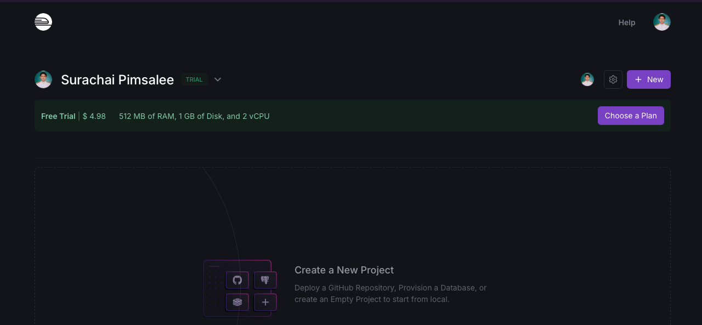
6. และเลือก "Deploy from GitHub repo"

7. เลือก repository "booking-app-demo"
 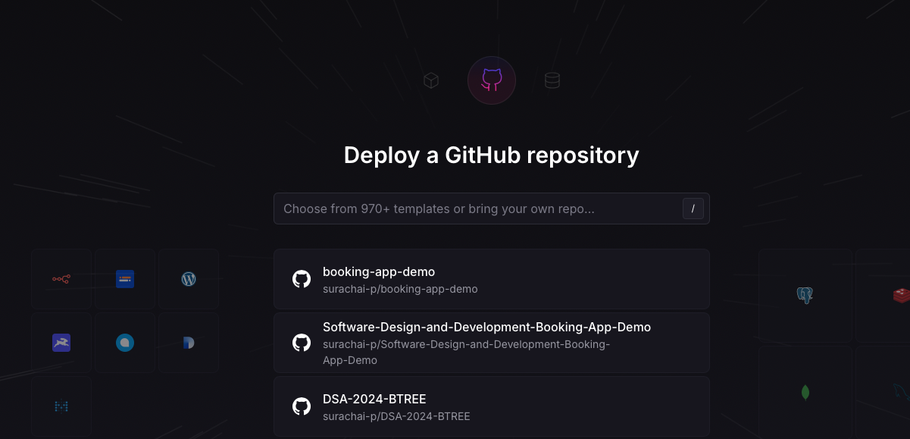
 ระบบจะ Deploy อัตโนมัติ แต่จะติด error ดังรูป
  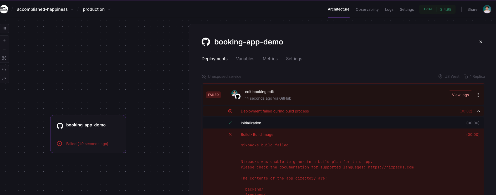
8. แก้ไขรายละเอียดของ Project เช่น Name
    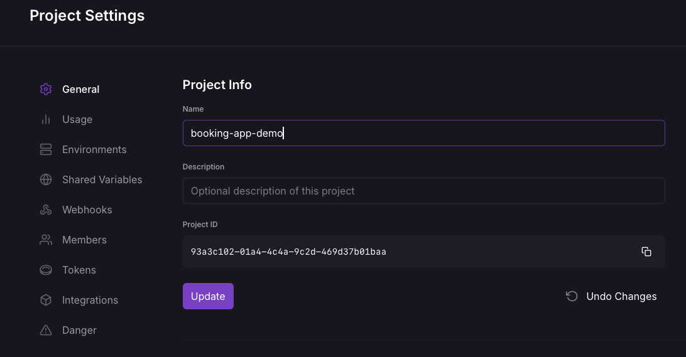
9. เลือกชื่อ Service ที่ปรากฏเพื่อเข้าไปแก้ไขการตั้งค่าต่าง ๆ
     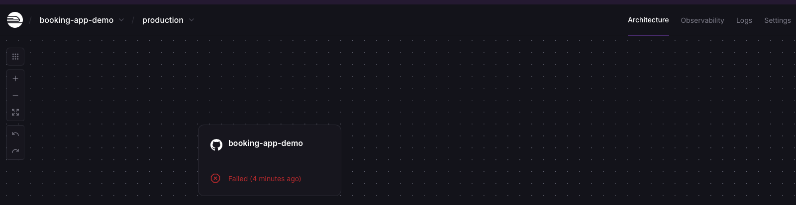
10. เลือกเมนู Settings ในขั้นตอนการตั้งค่า:
   - เลือก Add Root Directory กำหนดเป็น `\backend`
  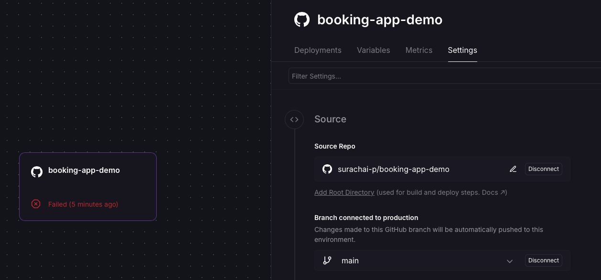
  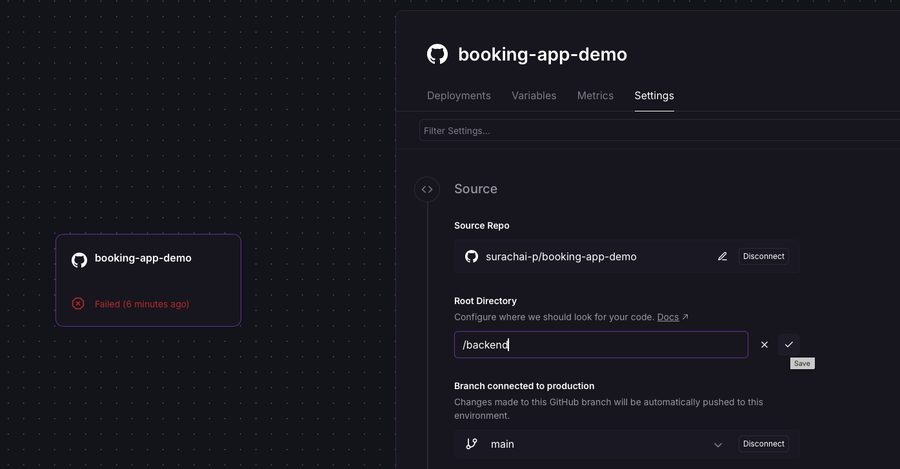
   - ตั้งค่า Environment Variables:
     - `PORT`: 3001
     - `JWT_SECRET`: [สร้าง key ที่ซับซ้อนและปลอดภัย]
     - `ALLOWED_ORIGINS`: https://your-frontend-app.railway.app (ใส่ URL ของ frontend ที่จะ deploy บน Railway ซึ่งต้องมาแก้ไขภายหลัง หลังจากที่ได้โดเมนของ Front-End แล้ว)
    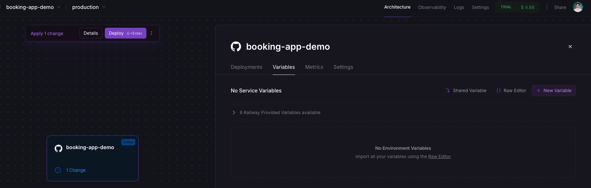
    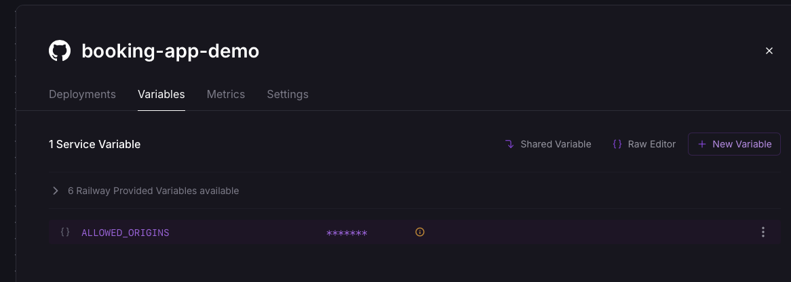
    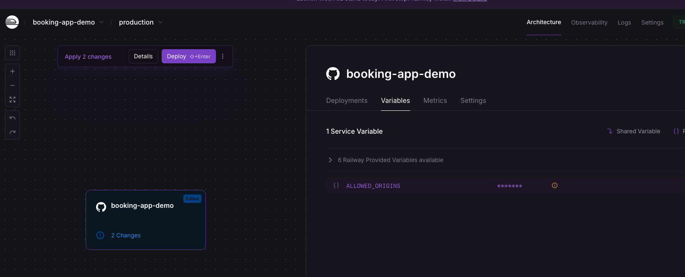
    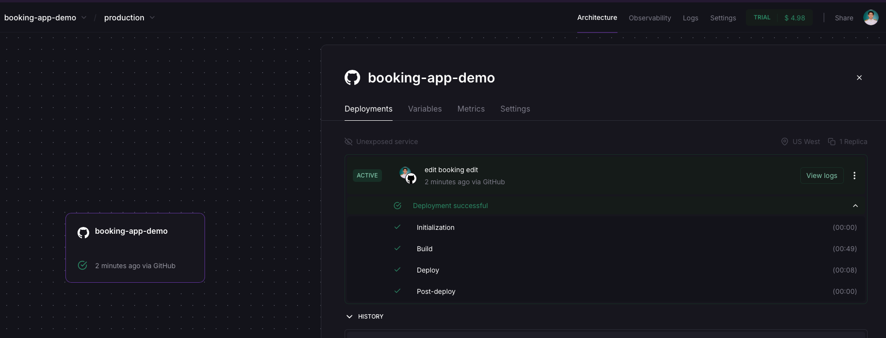
11.  คลิก "Deploy" และรอจนกว่าการ deploy จะเสร็จสิ้น
12. ในเมนู Settings เลือก Generate Domain เพื่อใช้สำหรับให้ front-end เชื่อมต่อ
    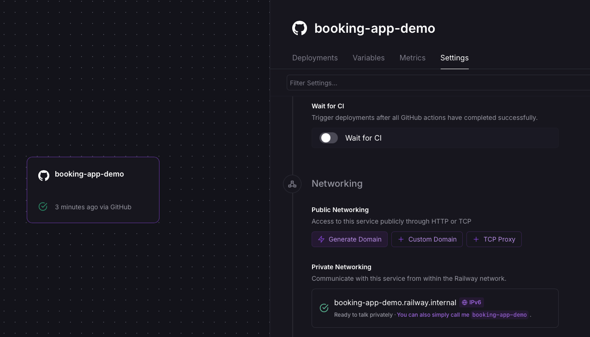
    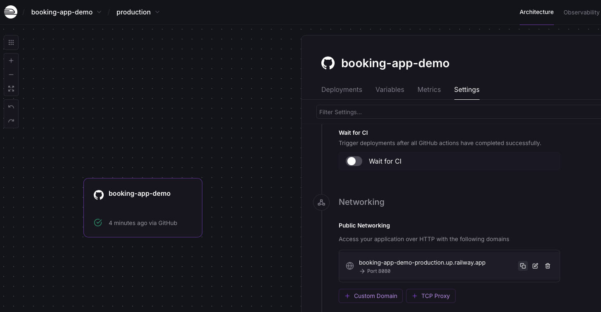
13. หลังจาก deploy สำเร็จ ให้คัดลอก URL ของ backend ไว้ (จะมีรูปแบบประมาณ https://booking-app-demo-production.up.railway.app)

14. ทดสอบการเชื่อมต่อกับ Back-end ด้วย Postman
    
  ### บันทึกผลการทดลองการเชื่อมต่อด้วย Postman
  รูปการ Login
 
  รูปการเพิ่มข้อมูลการจอง
 
  รูปการดูข้อมูลการจองทั้งหมด
 
  รูปการดูข้อมูลการจองโดยระบุ ID
 
  รูปการแก้ไขข้อมูลการจอง
 
  รูปการลบข้อมูลการจอง

### ส่วนที่ 6: การ Deploy Frontend บน Railway


1. เลือก "Create"
  
2. เลือก Empty Service
     
3. เปลี่ยนชื่อ Service เป็น Backend
4. กำหนด Root Directory เป็น `/frontend`
  

5. เลือก repository "booking-app-demo" จากรายการ GitHub repositories
6. ในส่วน "Environment Variables" ให้เพิ่ม:
     - `VITE_API_URL`: [วาง URL ของ backend ที่ได้จาก ขั้นตอนการกำหนด Back-end]
7. Generate Front-end โดเมน และทำการคัดลอกโดเมน
     
8. คลิก "Deploy" และรอจนกว่าการ deploy จะเสร็จสิ้น
  
9.  เมื่อ deploy เสร็จแล้ว Vercel จะสร้าง URL สำหรับเข้าถึงเว็บแอปพลิเคชัน (เช่น https://frontend-production-dfb9.up.railway.app)

10. แก้ไข .env ของ backend เพื่ออนุญาตให้เรียกใช้งานมาจาก Front-end ได้
```
PORT=3001
JWT_SECRET='your-secret-key'
ALLOWED_ORIGINS=http://localhost:5173,https://frontend-production-dfb9.up.railway.app

```
10. แก้ไข server.js ในส่วนที่อนุญาตให้ front-end สามารถเรียกใช้งานได้
```js
  const allowedOrigins = [
    'https://frontend-production-dfb9.up.railway.app/login', 
    'http://localhost:5173'
  ];
``` 
11. แก้ไขไฟล์ .env.production
```
VITE_API_URL=https://frontend-production-dfb9.up.railway.app/login
```
12. commit และ push ไปยัง GitHub ระบบของ railway จะทำการ Deploy ใหม่โดยอัตโนมัติ
    
### ส่วนที่ 7: การทดสอบระบบที่ได้ Deploy

1. ทดสอบการเข้าถึงหน้าเว็บของ frontend:
   - เปิดเบราว์เซอร์และเข้า URL ของ frontend (หรือคลิกเลือกจาก Front-end service แล้วคลิก URL ที่แสดงใน Front-end)
   - ตรวจสอบว่าหน้าเว็บแสดงผลถูกต้อง

2. ทดสอบการทำงานของระบบ:
   - ทดสอบการจองห้องพัก
   - ทดสอบการเข้าสู่ระบบ (ล็อกอิน)
   - ทดสอบการดูรายการจองทั้งหมด (ต้องล็อกอินก่อน) (การ Login สามารถพิมพ์ที่ URL ตามด้วย /login)

3. ทดสอบการอัปเดตโค้ดและ CI/CD:
   - แก้ไขโค้ดบนเครื่องของคุณ
   - ทำการ commit และ push การเปลี่ยนแปลง
   - ตรวจสอบว่า GitHub Actions ทำงานอัตโนมัติ
   - ตรวจสอบว่าการเปลี่ยนแปลงถูก deploy อัตโนมัติไปยัง  Railway 

## หมายเหตุสำหรับการทำงานแบบแยก Repository

หากต้องการแยก repository ระหว่าง frontend และ backend แทนที่จะใช้ monorepo approach สามารถทำได้ตามขั้นตอนดังนี้:


### การแยก Repository กรณีที่ต้องการแยก Repository ของ Front-end และ Back-end

1. สร้าง repository ใหม่สองตัวบน GitHub:
   - `hotel-booking-frontend`
   - `hotel-booking-backend`

2. ตั้งค่า Git สำหรับ frontend:
```bash
cd path/to/your/frontend
git init
git remote add origin https://github.com/[username]/hotel-booking-frontend.git
git add .
git commit -m "Initial frontend setup"
git branch -M main
git push -u origin main
```

3. ตั้งค่า Git สำหรับ backend:
```bash
cd path/to/your/backend
git init
git remote add origin https://github.com/[username]/hotel-booking-backend.git
git add .
git commit -m "Initial backend setup"
git branch -M main
git push -u origin main
```

4. ตั้งค่า GitHub Actions แยกกันในแต่ละ repository

5. สำหรับการ deploy:
   - Deploy frontend บน Railway โดยเลือก repository `hotel-booking-frontend`
   - Deploy backend บน Railway โดยเลือก repository `hotel-booking-backend`

6. ตั้งค่า environment variables ให้ถูกต้องในแต่ละแพลตฟอร์มเพื่อให้ frontend สามารถเชื่อมต่อกับ backend ได้

ข้อควรระวัง: การแยก repository จะทำให้ต้องจัดการการ deploy แยกกัน และต้องคอยอัปเดต environment variables ทั้งสองฝั่งให้สอดคล้องกัน ซึ่งอาจทำให้การจัดการโปรเจคยุ่งยากขึ้น

